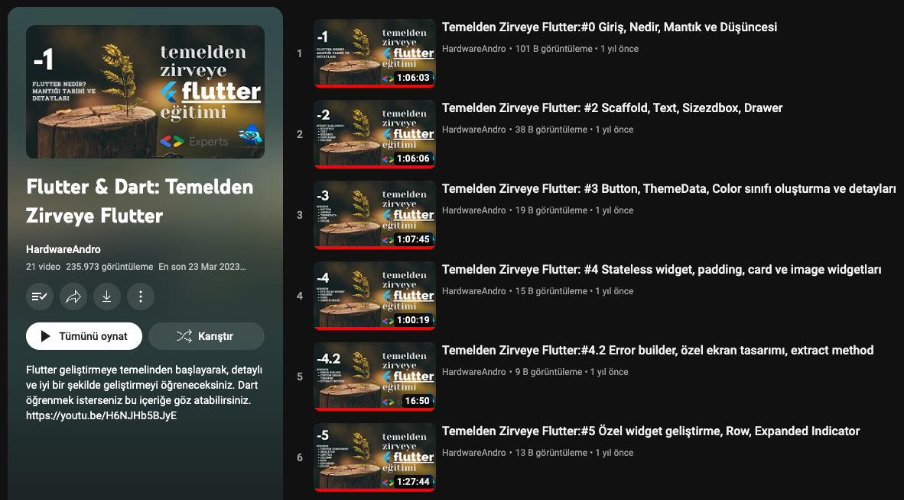

# Flutter Full Learn

https://youtube.com/playlist?list=PL1k5oWAuBhgXdw1BbxVGxxWRmkGB1C11l

## Description

It is a repository documenting my journey of learning Flutter from the basics to the summit.

This repository is a comprehensive collection of my progress in learning Flutter, starting from the fundamentals and advancing to more advanced topics. It serves as a testament to my growth as a Flutter developer, showcasing the skills and knowledge I have gained throughout my learning process. From building simple widgets to creating complex applications, this repository demonstrates various stages of my Flutter learning adventure. Whether you are a beginner seeking to embark on your Flutter journey or an experienced developer looking to gain insights into Flutter development, you will find valuable resources and examples here to guide you on your path to mastering Flutter. 

I would like to express my special thanks to Vali Bacık for inspiring and guiding me during my Flutter learning journey. Let's embrace the power of Flutter together and explore the potential of cross-platform app development!

## Contact

If you have any questions, feedback, or would like to connect, feel free to reach out to me.

- **Name:** Yusufhan Saçak
- **Email:** yusufhan.sacak@bahcesehir.edu.tr
- **Website:** https://medium.com/@yusufhansacak
- **Twitter:** [@0xSCK](https://twitter.com/0xSCK)
- **LinkedIn:** [Yusufhan Saçak](https://www.linkedin.com/in/yusufhansacak/)

Feel free to contact me through any of the channels above. I'm open to collaborations and discussions related to Flutter development or any other projects.
